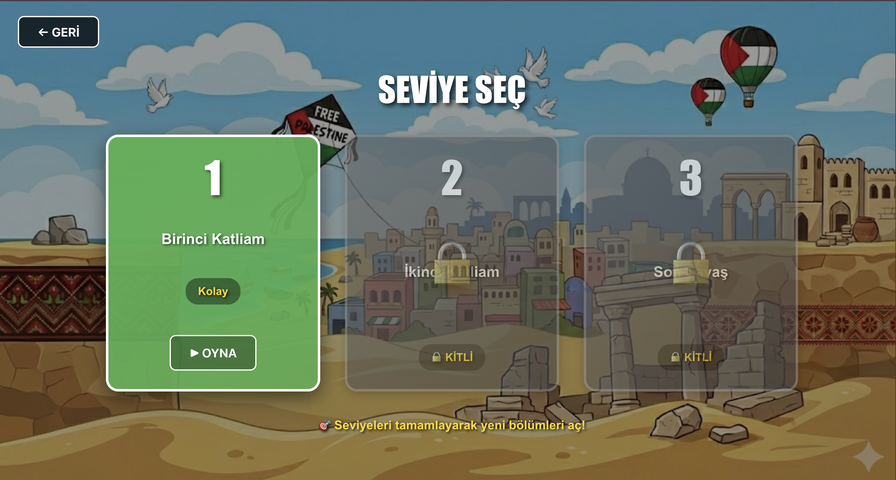
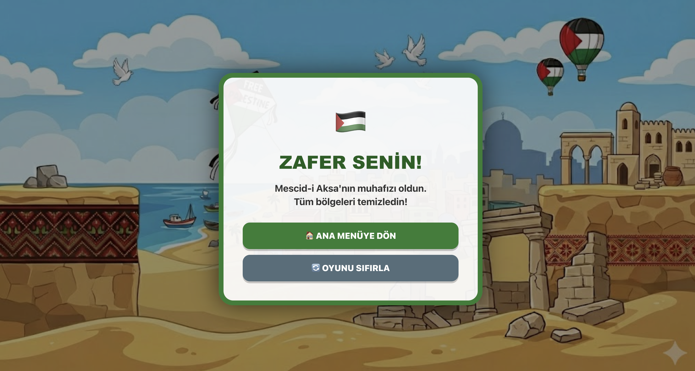

# 🐦 Angry Birds Clone (React + TypeScript)

A physics-based mini game inspired by **Angry Birds**, built with **React**, **TypeScript**, and **Vite**.

The objective is to launch the bird with the correct angle and power to destroy all targets.

---

## 📸 Screenshots

  
  
  
  
  
  

---

## 🎮 Features

- Slingshot shooting mechanics
- Angle & power calculation
- Multiple levels
- Collision detection
- Level completion screen
- Restart functionality

---

## 🛠️ Technologies

- React
- TypeScript
- Vite
- HTML5
- CSS
- ESLint

---

